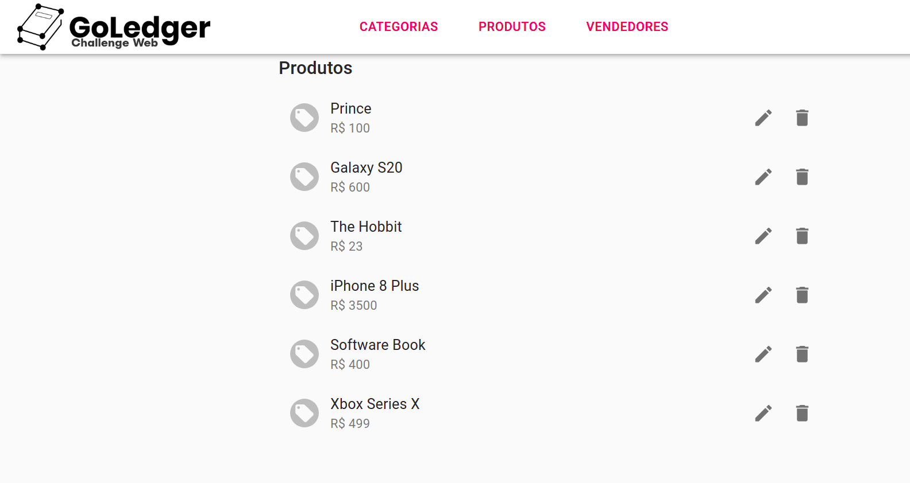

# GoLedger Challenge

Projeto de implementação de página de Marketplace

## Participante

### Alexandre Miguel Rodrigues Nunes Pereira**

## Tecnologias Utilizadas

| Nome | Versão |
| -- | -- |
| React | 17.0.2 |
| npm | 6.14.4 |
| Docker | 20.10.5 |
| docker-compose | 1.27.4 |

## Execução

Para executar o projeto, é necessário possuir o docker instalado na máquina, sendo assim basta seguir os seguintes passos

``` bash
# Clone do repositório
$ git clone https://github.com/aleronupe/goledger-challenge-web

# Vá para o diretório do projeto
$ cd goledger-challenge-web/blockchain-app

# Relize o comando do docker
sudo docker-compose up --build
```

## Uso

Ao executar os comandos acima, basta acessar o projeto pela url: 

``` bash
http://localhost:3000/
```

Assim, o site aparecerá para o usuário.



## Dependências

Bibliotecas utilizadas no projeto:

* [Material UI](https://material-ui.com/) - Para estilização do Frontend
* [Axios](https://www.npmjs.com/package/axios) - Para efetivação das chamadas
* [react-router-dom](https://reactrouter.com/web/guides/quick-start) - Para gerenciamento de rotas